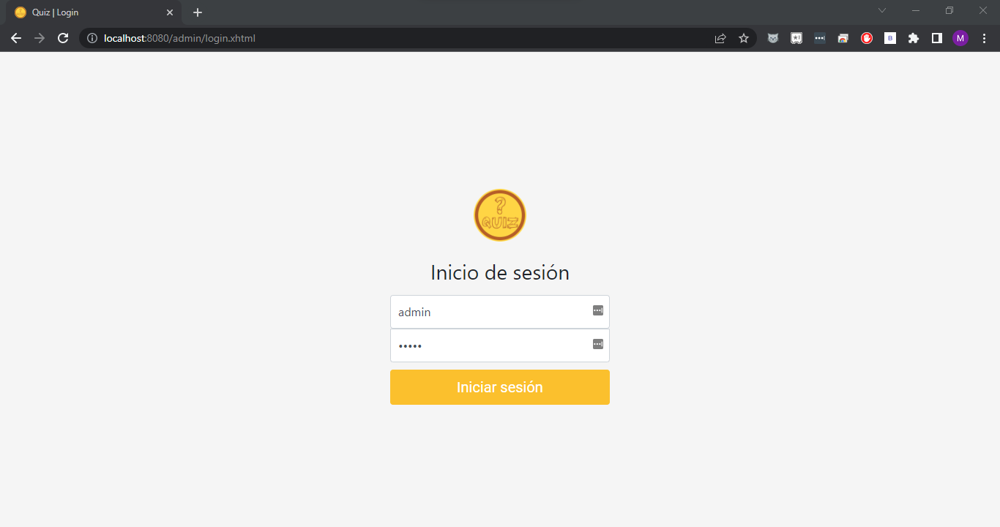
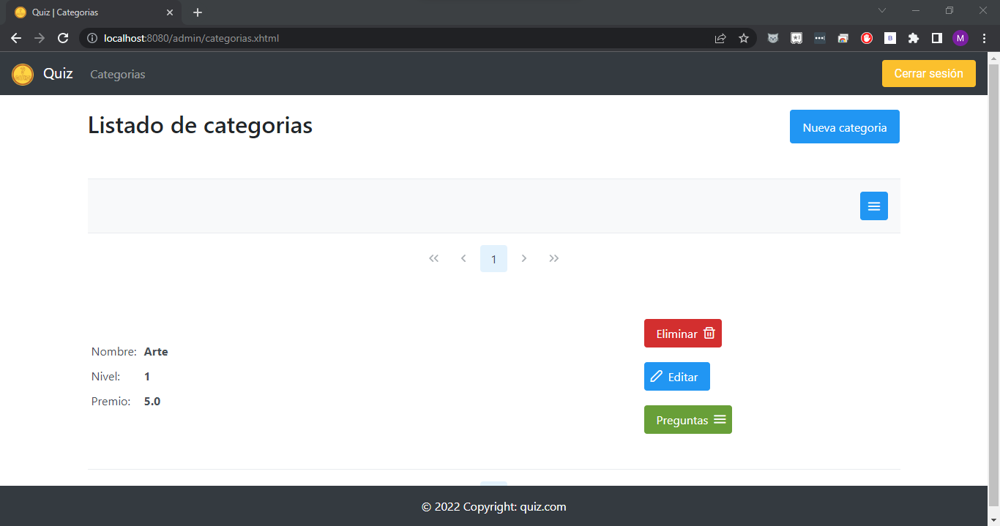
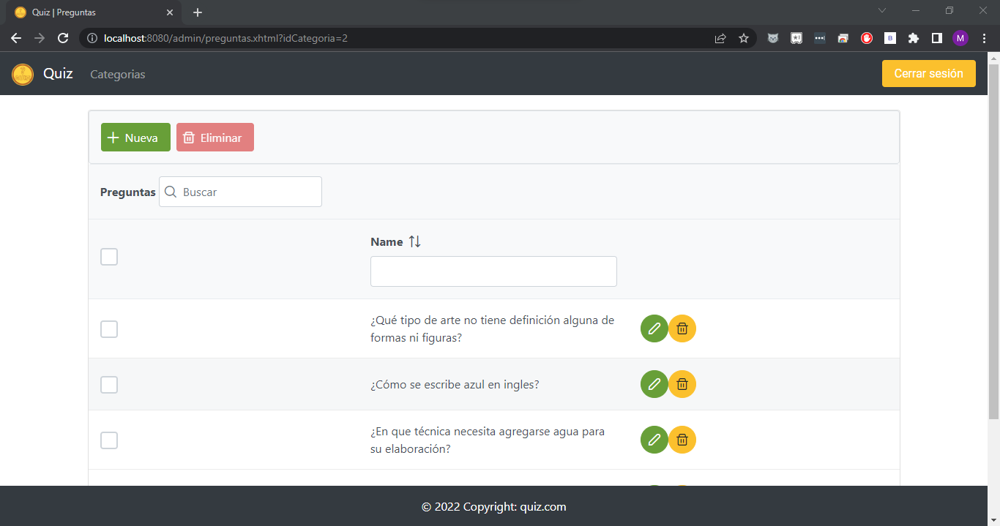
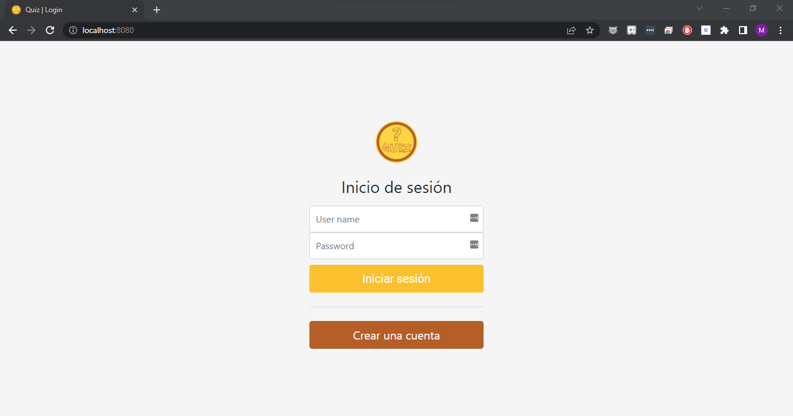
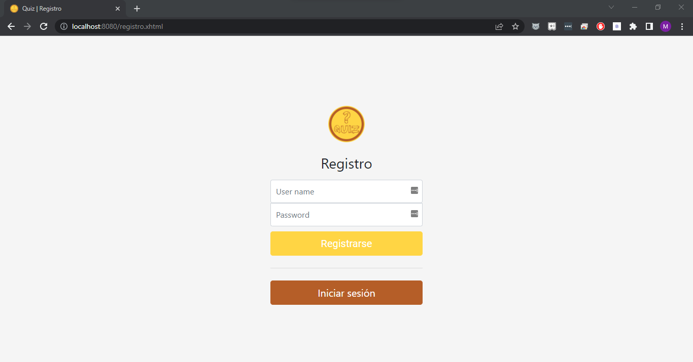
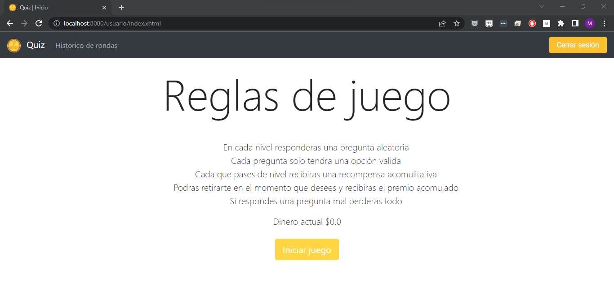
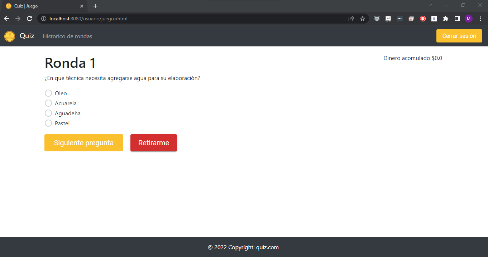
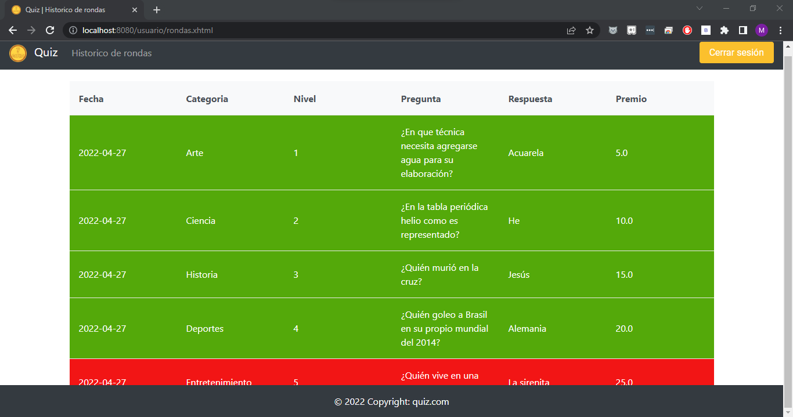

# Concurso de preguntas

La aplicación se realizo con Spring Boot, con el motor de base de datos mysql y para el front JavaServer Faces.

Para el desarrollo de la aplicación se utilizo intellij idea.

Para correr el programa debemos de crear en el motor de mysql una base de datos llamada concurso:

```sql
CREATE DATABASE concurso;
```

Luego importar el codigo en intellij idea y ponerlo a correr para que se creen las tablas en la base de datos.

En el archivo datos.sql se encuentran los datos que contienen las preguntas y respuestas.

# Funcionalidades

En el apartado del admin podemos gestionar todas las diferentes categorias, preguntas y respuestas con el CRUD creado. Debemos de iniciar sesión con el admin previamente creado, username = admin - clave = admin.







Para el usuario primero debe de registrarse y luego de iniciar sesión podra iniciar el juego, ver el dinero de su cuenta y ver el historial de rondas jugadas.









